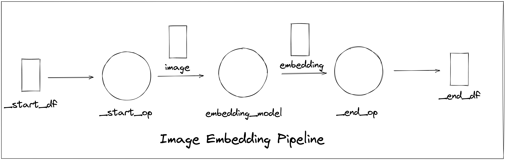

# DAG details

> Use the YAML file to define a Pipeline. In the YAML file, the name means the pipeline's name, the Operators are the nodes of this Pipeline , the dataframes are the edges of this Pipeline.  The Operator is used to execute calculation logic and the Dataframe is used to transport data between operators.


Example
```YAML

name: 'simple_pipeline'
operators:
    -
        name: '_start_op'
        function: '_start_op'
        init_args:
        inputs:
            -
                df: '_start_df'
                name: 'num'
                col: 0
        outputs:
            -
                df: 'input_df'
        iter_info:
            type: map
    -
        name: 'add_op1'
        function: 'local/add_operator'
        init_args:
            factor: 1
        inputs:
            -
                df: 'input_df'
                name: 'num'
                col: 0
        outputs:
            -
                df: 'internal_df'
        iter_info:
            type: map
    -
        name: 'add_op2'
        function: 'local/add_operator'
        init_args:
            factor: 2
        inputs:
            -
                df: 'internal_df'
                name: 'num'
                col: 0
        outputs:
            -
                df: 'output_df'
        iter_info:
            type: map
    -
        name: '_end_op'
        function: '_end_op'
        init_args:
        inputs:
            -
                df: 'output_df'
                name: 'sum'
                col: 0
        outputs:
            -
                df: '_end_df'
        iter_info:
            type: map
dataframes:
    -
        name: '_start_df'
        columns:
            -
                name: 'num'
                vtype: 'int'
    -
        name: 'input_df'
        columns:
            -
                name: 'num'
                vtype: 'int'
    -
        name: 'internal_df'
        columns:
            -
                name: 'sum'
                vtype: 'int'
    -
        name: 'output_df'
        columns:
            -
                name: 'sum'
                vtype: 'int'
    -
        name: '_end_df'
        columns:
            -
                name: 'sum'
                vtype: 'int'
```


